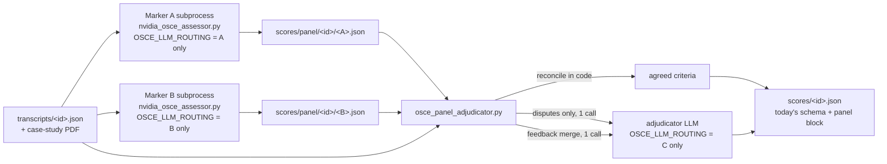

# Multi-model (panel) marking — design and implementation plan

Status: **Phase 0 and Phase 1 steps 4–7 implemented** (backend config surface,
no panel execution yet). Remaining: step 8 (Settings card), Phases 2–5.
Baseline: `2bdec8e`.

## 1. Goal

Add a Settings toggle between two content-marking modes:

| Mode | What runs | Default |
|---|---|---|
| `single` | Today's pipeline: one assessor subprocess against the operator's primary model (with fallbacks). | **yes** |
| `panel` | Two (or more) **markers** score the same transcript with the **same prompt** independently, in parallel. A third model — the **adjudicator** — settles only the criteria they disagree on and merges their coaching feedback. The final sheet is one document in today's schema, plus a `panel` block that records every vote. | no |

The word is *multi-model*, not *multimodal*: several LLMs over the same text,
not vision/audio input.

The modularisation this needs is done first and ships with no behaviour change:
`single` becomes "a panel of one" running through the same seams.

## 2. What the literature says (and what we take from it)

| Pattern | Representative work | Finding that matters here |
|---|---|---|
| Independent judges + aggregation ("jury", PoLL) | Verga et al. 2024; [orq.ai, LLM juries in practice](https://orq.ai/blog/llm-juries-in-practice) | Disagreement between independent judges is rare and, when it happens, flags the item as genuinely hard — the natural escalation signal. |
| Cascaded / selective escalation | [Trust or Escalate, ICLR 2025](https://proceedings.iclr.cc/paper_files/paper/2025/file/08dabd5345b37fffcbe335bd578b15a0-Paper-Conference.pdf) | Escalate to a second opinion only when confidence is low; guarantees agreement at a fraction of the cost of always asking everyone. |
| Multi-agent debate (MAD) | Du et al. 2023; Liang et al. 2023; ChatEval; [MAD for LLM judges with stability detection](https://arxiv.org/html/2510.12697v1) | Rounds of "read the other agent, revise" can improve reasoning tasks… |
| …and its failure modes | [Beyond Consensus (2026)](https://arxiv.org/html/2608.30373); [Emergence of Biased Consensus](https://arxiv.org/html/2608.02827v1); [Can LLM Agents Really Debate?](https://arxiv.org/html/2511.07784) | For *subjective scoring* MAD **worsened** RMSE (0.644 → 0.935) and correlation vs a single judge; strict-role personas dominate and drag scores down; debates converge fast to a shared *biased* answer; gains that do appear are mostly explained by aggregating independent outputs, not by the interaction; persuasive wording beats correct wording. Symmetric (neutral) roles and *sharing the scores* recovered near-baseline; masking scores made it worse. |
| Mixture-of-Agents synthesis | [Wang et al. 2024](https://arxiv.org/pdf/2406.04692); [Rethinking MoA (2025)](https://arxiv.org/abs/2502.00674); [When Agents Disagree (2026)](https://arxiv.org/html/2603.20324v1) | Letting an aggregator "compile" whole answers loses to a single strong model in 82 % of tasks; quality of proposers matters more than diversity; **"select, don't synthesise"** — judge-based selection won all 42 tasks over synthesis. |
| LLM graders in medical education | [Three LLMs as OSPE graders, psychometric analysis (2026)](https://pmc.ncbi.nlm.nih.gov/articles/PMC13353441/) | Rank-order correlation with humans strong for all models (ρ 0.78–0.92) but *categorical* agreement diverged: pass/fail agreement 52 % (κ 0.07) to 84 % (κ 0.68). Models are calibrated differently exactly at the decision boundary — which is what a second marker is for, and why averaging them blindly is wrong. |
| Agreement reporting | [Agreement measurement for rubric-based LLM judges (2026)](https://arxiv.org/html/2606.00093) | Report per-item agreement, κ and the disagreement list, not one number. |

Human OSCE practice says the same thing: examiners double-mark independently
and a third examiner moderates only the discrepancies.

**Design consequences**

1. **Independent first pass, identical inputs.** Both markers get byte-identical
   prompts and transcript. No personas, no "strict"/"lenient" roles.
2. **Reconcile deterministically, adjudicate only the split.** Per-criterion
   Yes/No is structured, so agreement is computed in code. The third model sees
   only the disputed criteria, both rationales *and the transcript evidence*, and
   is told examiner order is random. It never re-marks the sheet.
3. **No debate rounds in v1.** The research gain is small and the bias risk
   real. A single optional "revision round" is a v2 knob, default off.
4. **Synthesis only where it belongs.** Keep/Start/Stop and the overall summary
   are free text; merging two feedback blocks conditioned on the *final* verdicts
   is the one place an aggregator adds value.
5. **The adjudicator applies the same standard.** It is given the markers'
   leniency policy verbatim. A stricter third voice is the documented way to bias
   the whole panel downward.
6. **Every vote is kept.** The final file records both sheets, each dispute, who
   the adjudicator sided with and why. Agreement stats feed analytics; disputed
   criteria are the natural "review suggested" queue for a human.

## 3. Pipeline



The marker unit is the **unchanged assessor script**. That is what makes "same
prompt, same transcript" true by construction, gives each marker its own crash
checkpoint for free (the checkpoint path derives from the output path), and
means single mode and a panel marker are literally the same process.

### 3.1 Step-by-step at run time

1. `ScoringPipeline` asks `LLMSettingsService.marking_plan()` **once** at the
   start of `content_scoring`. The plan is a value (mode + resolved targets +
   credentials snapshot); a toggle flipped mid-run applies to the next run.
2. `single` → today's path, untouched.
3. `panel` → for each marker, in parallel (`asyncio.gather`):
   - output path `scores/panel/<id>/<markerKey>.json`, `markerKey` =
     slug of `provider:model` (so a marker swapped in Settings never adopts the
     other's file);
   - reuse the file if it passes `should_refresh_score_payload` **and** its
     `model_provider`/`model` match the configured marker; otherwise spawn the
     assessor with an environment built by `subprocess_env_for(marker_routing)` —
     routing = that marker alone, credentials = that provider alone.
4. Spawn `scripts/osce_panel_adjudicator.py --marker A.json --marker B.json
   --transcript … --case-study … --tie-break lenient --output scores/<id>.json
   --adjudication-output scores/panel/<id>/adjudication.json`.
5. Inside the adjudicator script:
   1. re-extract the rubric criteria from the PDF (same function the markers
      used) and align both sheets by index; label mismatch = hard error;
   2. reconcile: unanimous → settled (keep the rationale that carries a
      timestamp; keep both reasons); otherwise → dispute;
   3. compute `percent_agreement`, Cohen's κ (binary; `null` when undefined),
      and whether the markers already agree on pass/fail;
   4. if disputes exist: **one** batched call. For each dispute: label, critical
      flag, the two positions with examiner order shuffled per item (seeded by
      session id, so reruns are reproducible), the transcript window (±45 s)
      around each cited timestamp, plus the leniency policy verbatim. Reply
      schema `{"resolutions":[{index, value, timestamp, reason, sided_with,
      confidence}]}`; validated (every disputed index present, values in
      Yes/No); up to two repair passes; checkpointed like the assessor;
   5. if the adjudicator cannot answer at all: apply the configured tie-break
      per dispute (`lenient` = Yes, which is the rubric's own "when borderline,
      lean Yes"; `strict` = No; `first_marker`), mark each such criterion
      `resolution: "tie_break:<policy>"`;
   6. feedback merge: one small call with the final verdict table and both
      Keep/Start/Stop + summaries → one merged block. On failure, take the
      block from the marker whose verdicts are closest to the final sheet;
   7. `compute_scoring_summary(final)`; write the final sheet atomically.
6. `PipelineService` persists `outputs.scores` exactly as today; the
   `content_scoring` step carries `stepProgress` (0 → 40 per marker → 100) and
   `metadata.markingMode`.

### 3.2 Failure semantics

A panel must never fail an assessment that single mode would have passed.

| Event | Behaviour |
|---|---|
| One marker fails after its own retries | Final sheet = the surviving marker's sheet; `panel.degraded = {reason, effective_mode: "single"}`; step completes; UI shows a "single marker" banner. A re-run reuses the good marker's file and retries only the failed one. |
| Every marker fails | Step fails, exactly as single mode does today. |
| Adjudicator fails (all attempts) | Tie-break policy per dispute, flagged per criterion and in `panel.adjudicator.called = false`. |
| Adjudicator returns bad JSON | Two repair passes, then tie-break. |
| A configured marker has no API key here | Dropped at resolve time. If fewer than two remain, effective mode is `single` and Settings shows why *before* a run proves it (same "effective vs selected" contract the routing card already has). |
| Restart mid-panel | Job requeued as today; marker files on disk are adopted; a half-finished marker resumes from its own checkpoint. |
| Mode switched between runs | The final-sheet cache predicate is mode-aware (`marking_mode` field), so a stale single sheet is refreshed under panel and vice versa; marker files are still reused. |

Markers have **no fallback chain** in v1. A fallback that lands on the other
marker's model silently turns the panel homogeneous, which the MoA literature
shows is worth nothing; degrading loudly is the honest alternative. The
adjudicator also runs alone — falling back to a marker's model would let a
marker judge its own dispute.

## 4. Contracts

### 4.1 Settings (`app_settings`, no migration — key/value with merged defaults)

```jsonc
"llmMarkingMode": "single",                 // "single" | "panel"
"llmPanel": {
  "markers":     [ {"providerId": "nvidia",   "model": ""},
                   {"providerId": "gemini",   "model": ""} ],   // ≥ 2, distinct provider:model
  "adjudicator":   {"providerId": "deepseek", "model": ""},
  "tieBreak":      "lenient"                 // "lenient" | "strict" | "first_marker"
}
```

`PUT /api/settings` rejects (422): unknown provider ids (catalogue check, like
routing today), fewer than two markers or duplicate `provider:model` keys when
mode is `panel`, and a missing adjudicator. It *warns* rather than rejects when
the adjudicator equals a marker (self-preference) or both markers share a
provider family (low diversity); warnings come back through `describe()`.

`GET /api/settings/llm-providers` gains
`marking: {mode, selected, effective, warnings[]}` — `effective` is what would
run right now after credential filtering.

### 4.2 Subprocess environment

No new blob. Each subprocess gets its own `OSCE_LLM_ROUTING` (one target, no
fallbacks) and only that provider's key, all serialised from **one**
`resolve()` snapshot via `LLMSettingsService.subprocess_env_for(config)`.
`OSCE_LLM_CUSTOM_PROVIDERS` travels as today, so a custom gateway can be a
marker. Tie-break is a CLI flag, not an env var.

### 4.3 Final sheet — `scores/<id>.json`

Today's fields are unchanged (frontend, `AssessmentService`, analytics keep
working). Added:

```jsonc
"marking_mode": "panel",
"model": "panel(nvidia:nemotron… + gemini:gemini-2.5-pro → deepseek:deepseek-v3)",
"model_provider": "panel",
"panel": {
  "schema": "content-panel-v1",
  "markers": [
    {"key": "nvidia__nemotron-3-super", "provider_id": "nvidia", "model": "…",
     "artifact": {"url": "/media/scores/panel/<id>/nvidia__….json", "...": "..."},
     "summary": {"yes_count": 21, "pass_fail": "Pass"}},
    {"key": "gemini__gemini-2.5-pro", "...": "..."}
  ],
  "adjudicator": {"provider_id": "deepseek", "model": "…", "called": true,
                  "artifact": {"url": "/media/scores/panel/<id>/adjudication.json", "...": "..."}},
  "agreement": {"total": 25, "agreed": 22, "disputed": 3,
                "percent": 0.88, "cohen_kappa": 0.71, "pass_fail_agreed": true},
  "criteria": [
    {"index": 0, "votes": ["Yes", "Yes"], "resolution": "agreed"},
    {"index": 4, "votes": ["Yes", "No"],  "resolution": "adjudicated",
     "sided_with": 1, "confidence": 0.8, "reason": "…"},
    {"index": 9, "votes": ["No", "Yes"],  "resolution": "tie_break:lenient"}
  ],
  "degraded": null
}
```

Per-criterion `reason` on the final sheet is the adjudicator's for adjudicated
items and the timestamp-bearing marker's for agreed items; `panel.criteria`
keeps every original reason.

### 4.4 Storage

```
storage/output/scores/<id>.json                                   final (path unchanged)
storage/output/scores/panel/<id>/<markerKey>.json                  one full sheet per marker
storage/output/scores/panel/<id>/.<markerKey>.json.checkpoint.json assessor's own checkpoint
storage/output/scores/panel/<id>/adjudication.json                 disputes, prompts hash, raw reply, resolution table
```

Served by the existing `/media/scores` mount — `StaticFiles` serves
subdirectories, so nothing new is mounted.

### 4.5 Modules

```
fastapi_backend/app/llm/panel.py                   MarkingMode, PanelConfig (+ from_raw/to_public), marker_key()
fastapi_backend/app/pipeline/marking/__init__.py
fastapi_backend/app/pipeline/marking/base.py       MarkingPlan, ContentMarkerRunner (spawn one assessor: env, output path, log source)
fastapi_backend/app/pipeline/marking/single.py     SingleModelMarking — today's run_content_scoring body
fastapi_backend/app/pipeline/marking/panel.py      PanelMarking — markers in parallel, degrade rules, adjudicator spawn, progress
fastapi_backend/app/pipeline/marking/reconciliation.py
                                                   pure: align, reconcile, cohen_kappa, tie_break, shuffled_order, transcript_window
scripts/content_marking.py                         prompt + validation helpers extracted from nvidia_osce_assessor.py
scripts/scorer_checkpoint.py                       checkpoint helpers extracted from nvidia_osce_assessor.py
scripts/osce_panel_adjudicator.py                  the third call
src/MarkingModeSettings.jsx                        the Settings card
src/components/TargetPicker.jsx                    provider+model dropdown pair, extracted from LlmRoutingSettings.jsx
src/lib/llmProviders.js                            + panelWarnings(), buildPanelPayload(), describePanel()
```

`ScoringPipeline` keeps its public surface (`run_content_scoring`,
`should_refresh_*`) so every existing test double still fits; it becomes a
facade that picks a strategy from the plan.

## 5. Implementation steps

Each phase is independently mergeable and leaves the suite green.

### Phase 0 — Modularise, no behaviour change

1. ✅ **Extract shared content-marking helpers.** Move
   `extract_rubric_criteria_from_case_study_rubric`, `build_system_prompt`,
   `build_user_prompt`, `validate_output`, `compute_scoring_summary`,
   `normalize_yes_no`, `looks_like_transcript_quote` and the size constants
   from `scripts/nvidia_osce_assessor.py` into `scripts/content_marking.py`;
   move the checkpoint helpers into `scripts/scorer_checkpoint.py`. The
   assessor imports them. Add a `prompt_version` constant and stamp it on
   every sheet.
   *Test:* existing script tests; a parity test that the assessor's prompt for
   a fixture is byte-identical before/after.
2. ✅ **Introduce `app/pipeline/marking/`.** `ContentMarkerRunner.run(session,
   *, env, output_path, log_source)` holds the subprocess spawn currently
   inlined in `ScoringPipeline.run_content_scoring`; `SingleModelMarking`
   calls it once to `scores/<id>.json`. `ScoringPipeline.run_content_scoring`
   delegates.
   *Test:* `test_scoring_inputs.py` unchanged and green.
3. ✅ **`LLMSettingsService.subprocess_env_for(config, resolved)`** — the body of
   today's `subprocess_env()` parameterised on the routing; `subprocess_env()`
   becomes a one-line wrapper. `MarkingPlan` dataclass
   (`mode`, `single: RoutingConfig`, `panel: PanelConfig | None`,
   `resolved: ResolvedProviders`) and `marking_plan()` returning mode
   `single` for now.
   *Test:* extend `test_llm_settings_api.py` — env for a given config forwards
   only that provider's key.

   *As built:* `MarkingPlan` carries per-target `llm_env` dicts
   (`MarkerAssignment`) rather than the `ResolvedProviders` snapshot, so the
   pipeline layer never sees credential machinery; `ScoringPipeline.
   content_marking_plan()` mirrors `scoring_env()`'s "log and fall back to the
   environment" contract. Tests: `test_content_marker_runner.py`,
   `test_marking_plan.py`, `test_panel_config.py`. One deliberate side effect:
   `prompt_version` joined the assessor's checkpoint context, so a checkpoint
   written before this change is discarded (the run restarts; nothing is
   spliced).

### Phase 1 — Configuration surface

4. ✅ **`app/llm/panel.py`.** `MarkingMode` (`StrEnum`), `PanelConfig` with
   `from_raw` (tolerant, like `RoutingConfig.from_raw`), `to_public`,
   `validate()` returning errors/warnings, `marker_key(target)`.
   *Test:* `test_panel_config.py` — round trip, duplicate markers rejected,
   warnings for adjudicator == marker and shared provider family.
5. ✅ **`AppSettingsRepository`.** Keys `llmMarkingMode`, `llmPanel`, defaults,
   `marking_selection()` live read (no swallowing — like
   `llm_routing_selection`).
   *Test:* `test_app_settings.py`.
6. ✅ **Schema + route.** `UpdateSettingsRequest.llmMarkingMode`,
   `.llmPanel: PanelPayload`; route validates every target against the
   catalogue and applies `PanelConfig.validate()` when mode is `panel`.
   *Test:* `test_llm_settings_api.py` — 422 cases and the happy path.
7. ✅ **`LLMSettingsService`.** `marking_plan()` filters markers by
   `resolved.configured_ids()`; `< 2` usable → effective `single` with a
   reason; adjudicator without a key → effective tie-break-only (recorded as a
   warning). `describe()` adds the `marking` block.
   *Test:* effective-vs-selected cases.
8. ⬜ **Frontend Settings.** Extract `TargetPicker` from `LlmRoutingSettings.jsx`;
   new `MarkingModeSettings.jsx` card: Single/Panel segmented control, two
   marker pickers, adjudicator picker, tie-break select, warnings, per-target
   "Test" reusing `POST /llm-providers/test`. Wire into `SettingsPage.jsx`
   (its `updateSetting` already sends the whole settings body, so the new keys
   round-trip).
   *Test:* `src/lib/llmProviders.test.mjs` for `panelWarnings` /
   `buildPanelPayload`.

### Phase 2 — Reconciliation and the adjudicator

9. **`reconciliation.py` (pure).** `align_sheets(sheets, rubric_criteria)`,
   `reconcile(aligned) -> (settled, disputes)`, `cohen_kappa(votes_a,
   votes_b)`, `apply_tie_break(dispute, policy)`, `shuffled_order(seed, n)`,
   `transcript_window(transcript, hhmmss, seconds=45)`,
   `closest_marker(final, sheets)`. Re-exported through `scripts/llm_bootstrap.py`.
   *Test:* `test_panel_reconciliation.py` — full agreement, full disagreement,
   label mismatch raises, κ undefined when a marker is constant, N = 3 markers
   (unanimous or dispute), window at transcript edges.
10. **`scripts/osce_panel_adjudicator.py`.** Args per `scorer_inputs`
    (`--marker` repeatable, ≥ 2, exit 2 on missing inputs). Flow as §3.1 step 5.
    Adjudication and feedback prompts live in `content_marking.py` beside the
    marker prompts so the leniency block is shared, not copied. Checkpoint via
    `scorer_checkpoint.py`. Writes `adjudication.json` (disputes, shuffled
    order, prompt hash, raw replies, resolutions) and the final sheet.
    *Test:* `test_panel_adjudicator.py` — drive `adjudicate()` /
    `merge_feedback()` with an injected `complete` callable (a
    `ScriptedProvider` as in `test_llm_router.py`): happy path, bad JSON then
    repair, provider dead → tie-break, feedback merge fallback.

### Phase 3 — Panel execution in the pipeline

11. **`PanelMarking.run(session, plan)`.** Per-marker cache check
    (`should_refresh_score_payload` + identity match), parallel spawn through
    `ContentMarkerRunner` with `subprocess_env_for(marker)`, `gather(...,
    return_exceptions=True)`, degrade rules from §3.2, adjudicator spawn with
    `subprocess_env_for(adjudicator)`, progress callbacks, returns
    `artifact_metadata(final, "/media/scores")`.
12. **`ScoringPipeline` facade.** `prepare_content_marking(session)` returns
    `{plan, run(), refresh_predicate}`; the predicate is mode-aware
    (`payload.marking_mode`, marker keys, `degraded`). `PipelineService.
    _refresh_or_load_content_scores` uses the prepared predicate when present
    and falls back to the static one for the test doubles.
13. **Step state.** `content_scoring` step `metadata.markingMode` and a
    `panel` summary on completion; `stepProgress` through
    `_record_step_progress` (0 / 40 / 80 / 100). No new `PipelineStep`, so the
    card gauge and `PIPELINE_STAGE_SEQUENCE` are untouched.
14. **Persistence.** `AssessmentService` needs no change (whole payload is
    stored). Add `markingMode` to the session-list projection only if the card
    is to show a badge (optional).
    *Test:* `test_scoring_panel.py` with the fake runner from
    `test_scoring_inputs.py`: two spawns in flight at once with different
    `OSCE_LLM_ROUTING` and each env carrying only its own key; adjudicator
    receives both marker paths; one-marker failure degrades and a rerun
    respawns only that marker; adjudicator failure → tie-break; mode switch
    invalidates the final sheet but not the marker files.

### Phase 4 — Results UI

15. **Score card header.** `PanelSummary`: marker chips, adjudicator, "22/25
    agreed · κ 0.71", degraded banner when set.
16. **Criteria table.** Vote chips per marker, resolution badge
    (agreed / adjudicated / tie-break), adjudicator reason in an expander,
    links to each marker sheet through `resolveMediaUrl`. Disputed rows are
    the "review suggested" cue for a human examiner.
17. **Score-sheet export** includes the panel block.

### Phase 5 — Docs, evaluation, rollout

18. **CLAUDE.md** — a "Marking modes" section (contracts, failure table, the
    "select, don't synthesise" rationale). No new environment variables.
19. **Evaluation before changing the default.** On the labelled sessions:
    per-criterion agreement and κ vs human marks for `single` and `panel`;
    pass/fail agreement; dispute rate per rubric label (a criterion that is
    disputed often is rubric feedback for the department); tokens and
    wall-clock per mode. Only a measured gain moves the default.
20. **Later, in this order:** communication scorer on the same seams (ordinal
    labels: identical → settle, otherwise adjudicate; `lenient` = higher
    label); optional single revision round (`revisionRounds: 0|1`, default 0);
    dispute-rate chart on the analytics page; a human-review queue fed by
    `panel.criteria[resolution != "agreed"]`.

## 6. Decisions taken, open questions

Taken:

- Marker = the unchanged assessor subprocess. Same prompt by construction,
  checkpointing for free, the same process-isolation and exit-code contract
  every other LLM step has.
- Adjudicate disputes only; never re-mark; never free-form "compile" two sheets.
- Tie-break default `lenient`, matching the rubric's own instruction.
- Degrade loudly instead of failing when one marker dies.
- One `content_scoring` step; sub-progress via `stepProgress`.

Open:

- Should a *critical* criterion that ends on a tie-break be surfaced as
  "needs human review" regardless of the policy? (Leaning yes — it decides
  pass/fail on its own.)
- N > 2 markers: the reconciliation handles it (unanimous or dispute) but the
  Settings card is designed for two. Leave at two until evaluation asks.
- Whether the adjudicator's `confidence` is worth storing at all — LLM
  self-reported confidence is poorly calibrated; kept for analysis, never for
  decisions.
