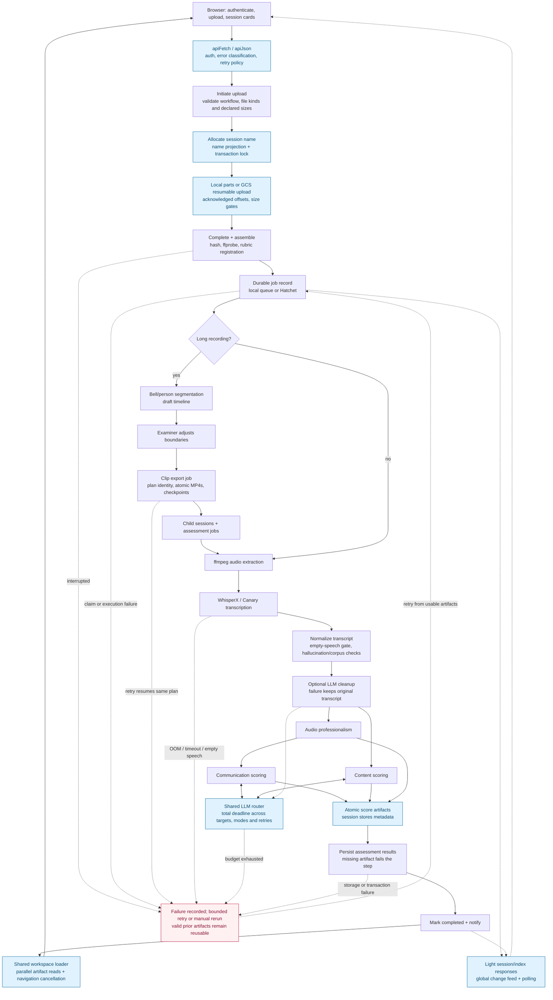

# Pipeline reliability audit

Source baseline: `8867c3ed7b3e6aa9d01f3fbf8235d75f79ef3434`.
The diagram was reconstructed from routes, services, workers, scripts and tests;
no generated code graph was available.

## Verdict

The remaining issues were reproducible design weaknesses: unbounded nested LLM
retry budgets, expensive session-document scans, oversized polling responses,
unused per-session event retention, and duplicated request/scoring logic.
This change adds bounded execution, narrower reads, shared contracts and
recovery tests. It also fixes two assessment-persistence failures discovered
while simulating the real SQLite and file-artifact path.

This is a source audit plus automated failure injection, not evidence that a
live GPU/provider/storage deployment cannot fail. The outstanding operational
risks and untested infrastructure paths are listed below.

## Reconstructed pipeline and failure boundaries



Blue nodes contain the main guardrails changed in this PR. The red node is a
recovery boundary, not a claim that every failure is automatically recoverable.
Disk loss, revoked credentials and a missing GPU model still require an
operator or a repaired environment.

The content branch overlaps the audio → communication branch. Their expected
critical path is approximately `max(content, audio + communication)`, plus
transcription and persistence. Serializing all three scorers would increase
latency without improving their data dependencies. Existing concurrency tests
verify that the branches actually overlap and that a failed branch does not
discard another branch's completed artifact.

## Findings and changes

| Issue | Failure or inefficiency | Change and justification |
| --- | --- | --- |
| F11 — LLM total deadline | Per-attempt timeouts multiply across providers, request modes, retry delays and SDK behavior. A worker slot can remain occupied long after a reasonable request budget. | One monotonic deadline per `LLMRouter.complete()`, default 900 seconds via `LLM_TOTAL_TIMEOUT_SECONDS`. Each attempt receives the remaining budget. Oversized backoff fails immediately; late success is rejected. Synchronous transports and validation run behind a bounded daemon-thread wrapper so an SDK inactivity timeout cannot hold the caller forever. |
| F12 — payload scans | Uploads, clip assessment, clip summaries and name maintenance transferred entire session JSON documents to find a few fields. Renames could race and collide. | Names use name-only projections and transaction-scoped allocation locks. Child summaries filter by indexed parent ID and project metadata/paths. Rename/backfill update name columns without replacing the payload. Conditional version checks protect concurrent whole-document writes. |
| F13 — unused per-session SSE | The browser uses a global change feed and polling; retaining per-session history still costs memory and suggests cross-process delivery that an in-memory service cannot provide. | `SESSION_SSE_ENABLED=false` by default. Publication retains no state while disabled; the per-session route returns 410 with polling guidance. Opt-in retains the compatibility stream and checks session existence. Global `/api/events` remains available. |
| F14 — embedded scores | Repeated session reads serialized the same large score documents. Payload copies could drift from artifact files. | New score outputs contain file metadata; public session responses omit the three embedded scoring payloads. Dedicated endpoints load artifacts. Legacy embedded data remains readable; old rows are not destructively migrated. |
| F16 — frontend networking | Duplicated fetch and workspace paths handled authentication, failures, missing artifacts and navigation inconsistently. Serial reads increased workspace latency. | Backend operations use `apiFetch`/`apiJson`; one workspace loader requests independent artifacts concurrently. A shared abort controller prevents stale navigation results from replacing the current workspace. 404 fallback preserves old embedded responses; other failures remain visible. |
| Direct storage upload recovery | A lost upload response creates uncertainty about which bytes the server committed; blind offset advancement risks corruption or endless retries. | Shared resumable uploader probes the acknowledged offset, probes again after uncertain responses, and rejects invalid or unchanged ranges. Storage/demo failures do not mark the backend unreachable. |
| Enums | Hand-mirrored strings drift between schemas, services, jobs and UI. Invalid workflow values can choose the wrong processing branch. | Backend domain enums preserve wire values, including legacy `whisperx`. Frontend exports are generated; `--check` fails on drift. Workflow, segmentation, file-kind and clip-kind inputs use enum validation. |
| Backend duplication | Artifact dictionaries, output loaders, progress mutation, failure handling and timestamp parsing diverged between services. | Shared artifact helpers, `OutputSpec`, lifecycle helpers, environment parsers and UTC utilities. Stateful orchestration stays in its owning service. |
| Scoring-script duplication | Parallel implementations differed in JSON handling, timestamps and transport policy. Identically named temporary files could collide. | Shared core helpers are re-exported by `llm_bootstrap`. Scorer-specific reasoning and mode order remain explicit. Content transcripts keep milliseconds; communication transcripts keep second precision. Atomic writes use unique temporary names and cleanup. |
| Missing artifact at persistence | Deleting a score artifact after scoring but before assessment persistence silently skipped the result, allowing a completed session with no assessment row. | A declared output that cannot be read now fails persistence. A rerun reconstructs the missing score and persists the result before reporting completion. |
| Nullable legacy clip source | A persisted legacy session without `workflow` and with `clipSource=null` crashed when assessment persistence accessed `.get()` on null. | Null-safe fallback preserves legacy records and allows assessment persistence to finish. |

### What the improvements do not imply

- Name allocation is still **O(number of names)**. It no longer loads all score
  documents. For a very large installation, add a normalized name column with
  a unique index and use conflict-driven allocation; migrating existing
  case/whitespace-equivalent names needs a deliberate data migration.
- JSON projections reduce network transfer and Python allocations. SQLite may
  still parse the underlying JSON inside the database. They are not a promise
  of zero payload I/O.
- Old session rows may still contain legacy payloads. New writes and public
  responses avoid them; an offline, verified backfill could compact old rows.
  Assessment-result tables intentionally retain result data for analytics.
- The LLM budget covers **one router completion**, including all its fallback
  attempts. Scorer repair/requery rounds make additional completions, and job
  retries can rerun a scorer. The subprocess watchdog remains the outer bound.
  A 900-second request budget is not a 900-second whole-pipeline SLA.
- Timed-out SDK threads cannot be forcibly killed safely. They are capped at
  eight live transports per process and their results are discarded; process
  termination is the final cleanup boundary. This also means repeated stuck
  probes can exhaust transport capacity until they finish or the process is
  restarted.
- Per-session SSE is process-local even when enabled. Distributed workers
  should continue using durable state/global change tracking, or adopt a
  shared event broker before relying on per-session live events.

## Simulations and evidence

All simulations below are reproducible tests. Media and vendor behavior is
substituted where stated; no external LLM billable calls are required.

| Scenario | Evidence | Verified result |
| --- | --- | --- |
| Primary fails after 6 of 10 budget seconds | `test_llm_deadline.py` | Fallback receives only the remaining 4 seconds; the caller's request is unchanged. |
| Exhausted budget, oversized retry delay, late response, non-cooperative SDK | `test_llm_deadline.py`, `test_llm_router.py` | Retry/mode expansion stops, late success is rejected, and a blocking transport releases its caller. Provider fallback/provenance remain intact. |
| Twelve simultaneous same-name creates through two SQLite connections | `test_session_hardening.py` | Unique names, length bounds and duplicate-rename rejection; no full session scan permitted by the test repository. |
| Rename collides with a stale pipeline document | `test_session_hardening.py`, `test_session_concurrency.py` | Stale writes are refused; retrying mutators preserve the concurrent changes. |
| Missing/corrupt score cache → regenerate → persist → reopen | `test_pipeline_artifact_recovery.py` | Real SQLite/session/assessment repositories and artifact files are exercised. Scoring is substituted with a deterministic file producer. Results persist before completion; reopen reuses the artifact without a second scoring call. |
| Artifact disappears immediately before persistence | `test_pipeline_artifact_recovery.py` | Persistence fails without reporting completion; repair/rerun produces exactly one assessment result. |
| One parallel scoring branch fails | `test_pipeline_service.py` | The other branch's output survives for reuse. |
| Empty or missing transcript | `test_empty_transcript_guard.py`, `test_transcript_cache_fallback.py` | Empty speech never reaches scoring; a missing transcript can return to transcription. |
| Hung child process | `test_production_hardening.py`, `test_command_runner.py` | The real subprocess watchdog terminates the child and reports failure. |
| Interrupted upload, concurrent parts, failed job claim, export retry/re-split | `test_pipeline_integrity.py`, `test_clip_export_job.py`, `test_job_queue_local_retry.py` | Recovery preserves the session document; same-plan export resumes; a new plan cannot adopt old footage; retries stop at their cap. |
| One-megabyte legacy score | `test_session_hardening.py` | Public session serializes below 2.5 KB while the full result remains retrievable. This is a controlled size assertion, not a deployment benchmark. |
| Per-session events disabled/enabled | `test_session_hardening.py` | Disabled publication retains no state; explicit opt-in delivers event ID, timestamp and body. |
| Workspace cancellation, missing artifact, auth/server failure | `test/sessionWorkspace.test.mjs` | Independent artifacts load concurrently; the abort signal is shared; only missing artifacts receive the legacy fallback. |
| Resumed upload, lost response, invalid/no-progress offset | `test/resumableUpload.test.mjs` | Server acknowledgement controls the next byte; invalid/no-progress results fail rather than loop or skip data. |
| Scorer module and CLI compatibility | `test_shared_scorer_utils.py` | Scorer policy/provenance, JSON extraction, concurrent atomic writes, help exit 0 and invalid-input exit 2 are preserved. |

### Reproduce verification

Local verification on Python 3.12 / Node 24:

| Check | Result |
| --- | --- |
| Complete backend suite | 829 passed, 1 skipped; 16 teardown/deprecation warnings |
| Frontend unit suite | 129 passed |
| Focused ESLint + Ruff + enum drift check | Passed |
| Production frontend build | Passed; 559.93 KB JavaScript chunk, 162.80 KB gzip |
| Python compile/import syntax check | Passed |
| Isolated SQLite migrations + schema check | Head `0006`; no pending schema operations |
| Runtime-only npm dependency audit | No reported vulnerabilities |

Use the pinned Python 3.12 environment and Node 22.13+ or 24+.

```sh
uv sync --group dev
npm ci
npm run lint
DEFAULT_ADMIN_PASSWORD=admin uv run --no-sync python -m pytest fastapi_backend/tests -q
npm run test:ui
npm run build
uv run --no-sync python -m compileall -q fastapi_backend/app scripts
```

The password is only the seeded local test account. On PowerShell, set
`$env:DEFAULT_ADMIN_PASSWORD="admin"` before running the backend tests.

Migration verification uses a separate SQLite file, never an existing
deployment database:

```sh
cd fastapi_backend
uv run --no-sync alembic -x db_url=sqlite:///audit.sqlite3 upgrade head
uv run --no-sync alembic -x db_url=sqlite:///audit.sqlite3 check
uv run --no-sync alembic -x db_url=sqlite:///audit.sqlite3 current
```

The isolated migration run reached `0006 (head)` and reported no new upgrade
operations. No database schema change is required by this PR.

## Remaining risks and recommended next work

| Priority | Risk / limitation | Recommended action |
| --- | --- | --- |
| High | Artifact storage and the database are separate durability domains. Metadata cannot reconstruct a lost source video or rubric. | Back up and restore-test both; ensure API and worker see the same artifact storage. Do not garbage-collect files still referenced by sessions/jobs. |
| High | Name locks and transaction guards were exercised with SQLite, not a live PostgreSQL deployment. Real GCS resumable CORS/header behavior and Hatchet retries were substituted in tests. | Run the deployment matrix with PostgreSQL, GCS and Hatchet before rolling out to those configurations. |
| High | GPU memory pressure, WhisperX/Canary downloads, ffmpeg behavior on Windows, and vendor streaming/rate limits depend on actual hardware and credentials. | Run one standard video and one multi-clip recording on the target worker, then interrupt/restart the worker during transcription/export and verify resume behavior. |
| Medium | Cached transcript validity is not equivalent to existence. Malformed legacy files may require an explicit full rerun. | Validate cached transcript schema and source/config identity; do not reuse results after changing the source/rubric/model without invalidating the relevant cache. |
| Medium | Some tests leave SQLAlchemy/aiosqlite resources alive across separate `asyncio.run()` loops, producing connection-finalizer warnings at teardown. | Give these harnesses one lifespan and dispose their engines before closing the loop. The suite passes, but these warnings are not evidence of clean teardown. |
| Medium | The frontend remains a large component and the production bundle exceeds Vite's 500 KB warning threshold. | Extract settings, clip workspace and results views behind stable interfaces; use route-level lazy loading and measure bundle/interaction changes. Request deduplication alone does not solve rendering cost. |
| Medium | `npm audit` reports development-tool advisories in Vite/esbuild, browserslist and postcss-selector-parser. Runtime-only audit reports no advisories. | Upgrade the affected build tools in a focused compatibility change and rerun the dev-proxy, Windows launcher and build tests. Avoid exposing the development server to untrusted traffic meanwhile. |
| Medium | Model outputs can be structurally valid and still clinically wrong. | Retain rubric/model provenance and examiner review; evaluate against a held-out marked dataset. Pipeline success is not evidence of assessment validity. |

Browser-driven interaction and live GPU/vendor/cloud tests have not been run
as part of this automated simulation. Their absence is not recorded as a pass.
